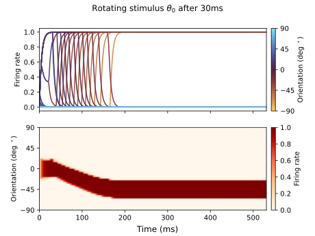
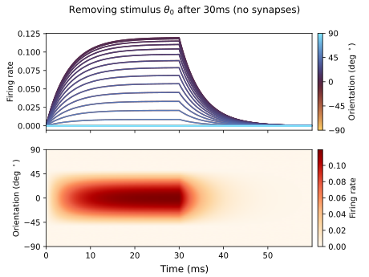
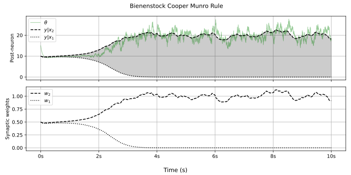
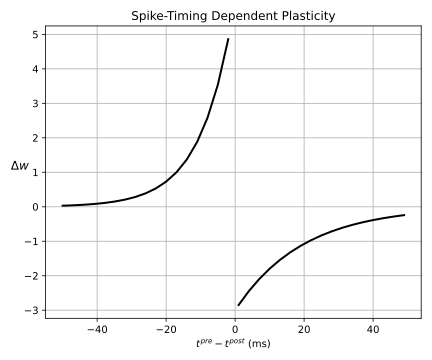
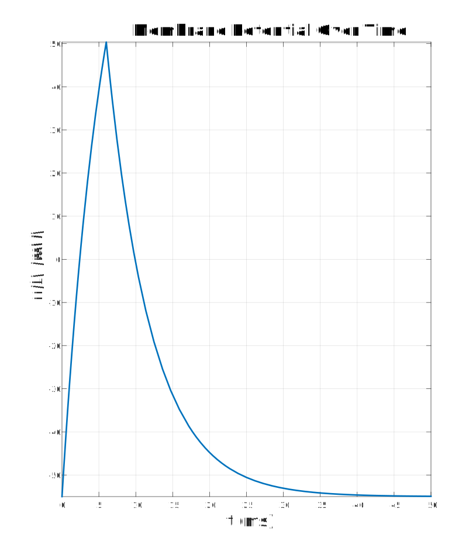
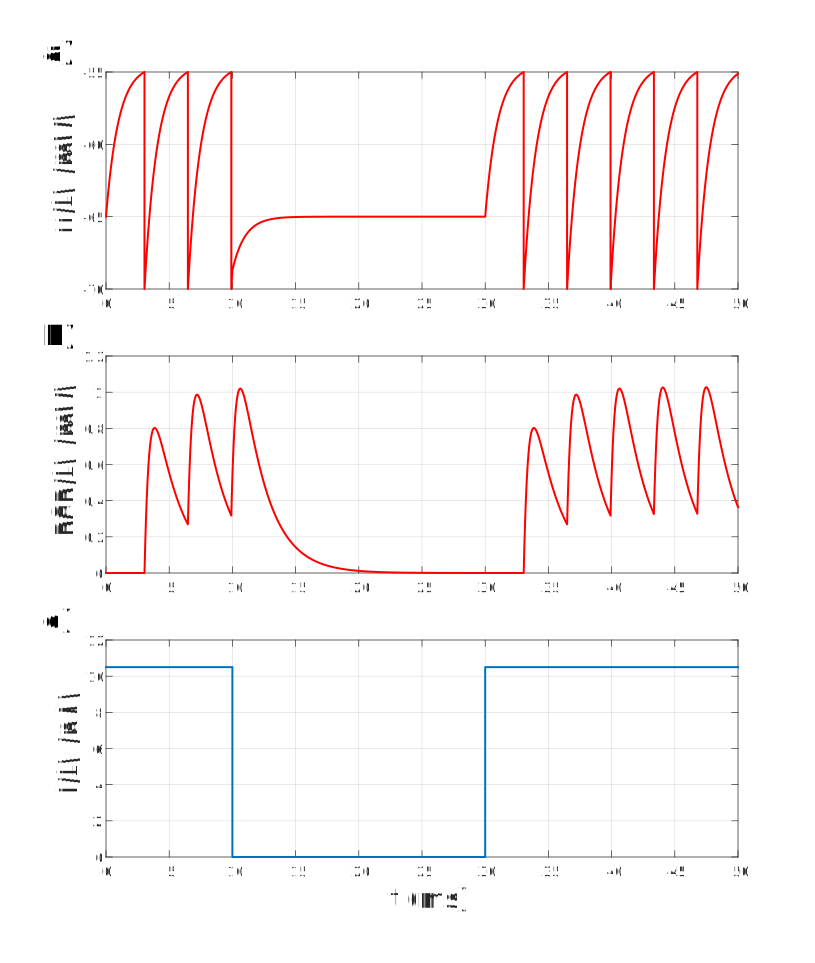
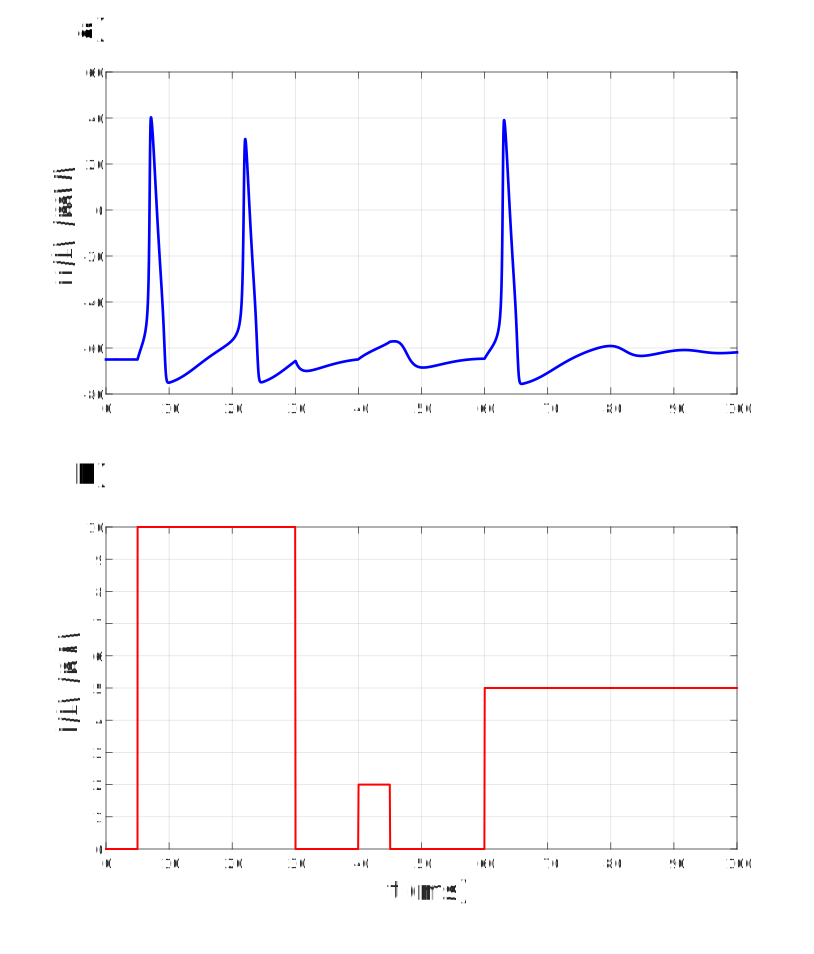
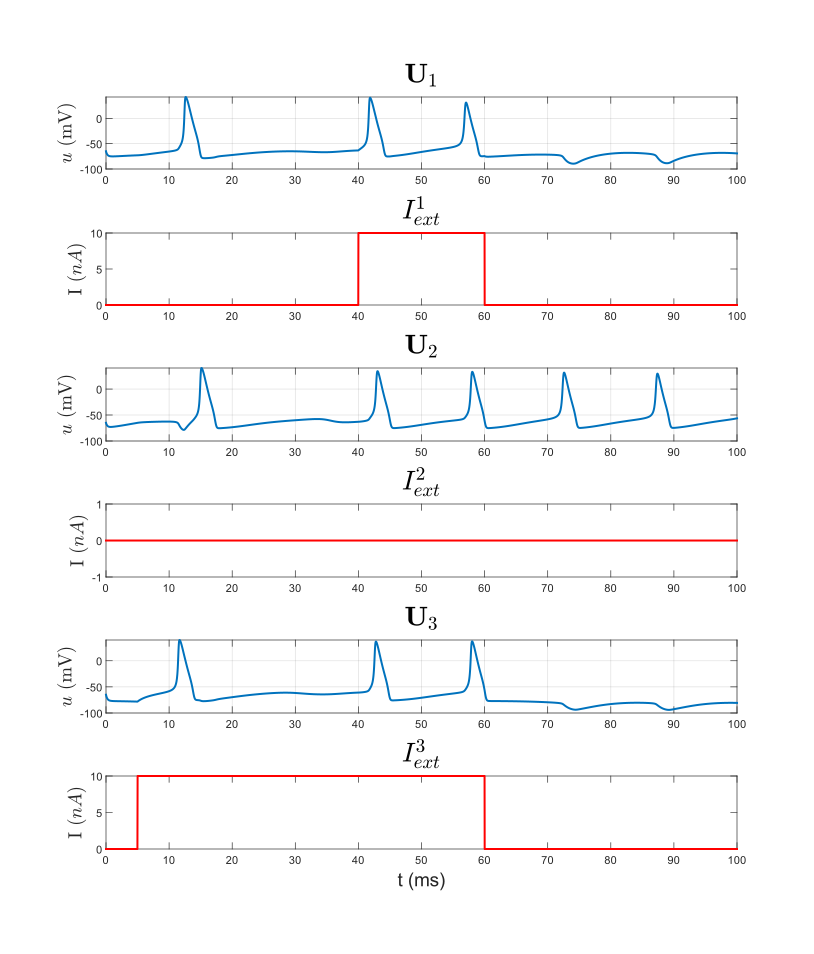

# Neuronal models playground
This is my Matlab/Pyhton implementation of some rudimentary neuron models.  
The plan is to use them as a framework to play around with different plasticity rules.

---

# Rubin-Terman STN neuron
<table>
  <tr>
    <td></td>
    <td></td>
  </tr>
  <tr>
    <td colspan="2" align="center"><figcaption>
      STN neuron, hyperpolarising Ca-driven rebound bursts
    </figcaption></td>
  </tr>
</table>

---

# Stimulus orientation selective firing-rate-based ring network
<table>
  <tr>
    <td></td>
    <td></td>
  </tr>
  <tr>
    <td colspan="2" align="center"><figcaption>
      Ring network of neurons selective to stimulus orientation
    </figcaption></td>
  </tr>
</table>

---

# Plasticity
<table>
  <tr>
    <td></td>
    <td></td>
  </tr>
  <tr>
    <td colspan="2" align="center"><figcaption>
      (1) (2 pre -> 1 post) BCM rule (2) (1 pre -> 1 post) STDP rule
    </figcaption></td>
  </tr>
</table>

# Integrate and fire 

<table>
  <tr>
    <td></td>
    <td></td>
  </tr>
  <tr>
    <td colspan="2" align="center"><figcaption>
      (1) Pulse and Instant current on IF model, (2) Instant current on IF model
    </figcaption></td>
  </tr>
</table>

---

# Hodgkin-Huxley

<table>
  <tr>
    <td></td>
    <td></td>
  </tr>
  <tr>
    <td colspan="2" align="center"><figcaption>
      (1) Single HH unit, (2) HH network units and current
    </figcaption></td>
  </tr>
</table>

---

# References
> [Gerstner, W., Kistler, W.M., Naud, R. and Paninski, L., 2014. Neuronal dynamics: From single neurons to networks and models of cognition. Cambridge University Press.](https://neuronaldynamics.epfl.ch/online/Ch1.S3.html)
